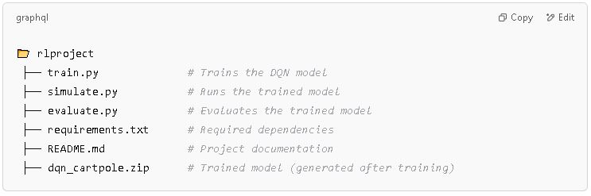
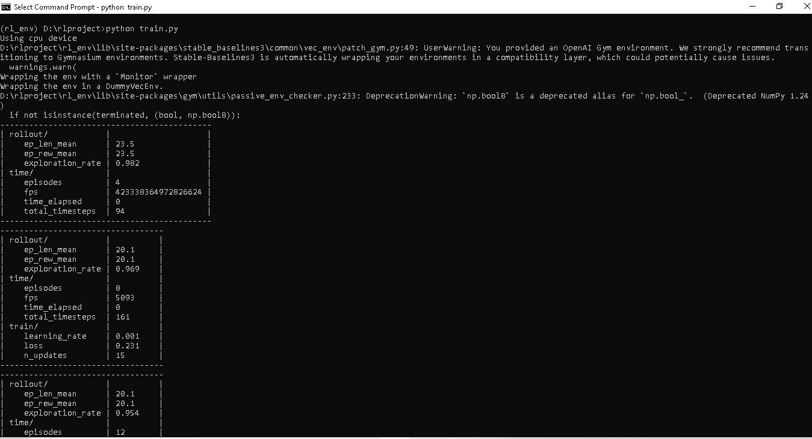
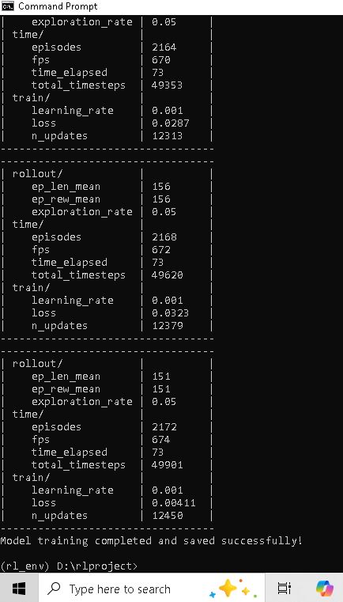
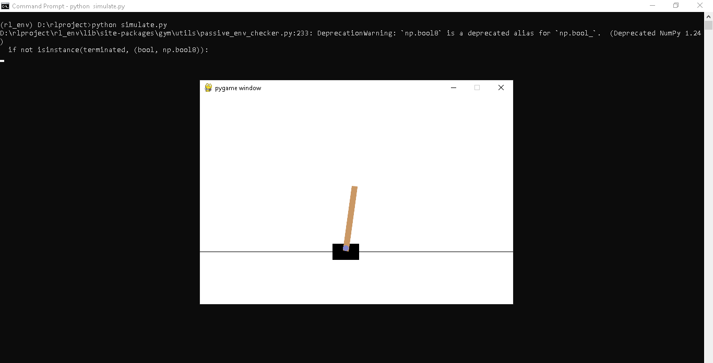
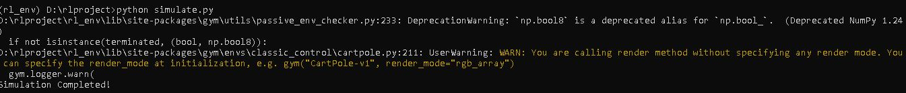
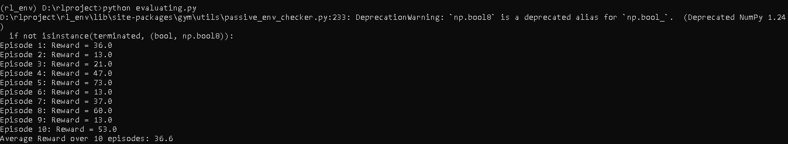
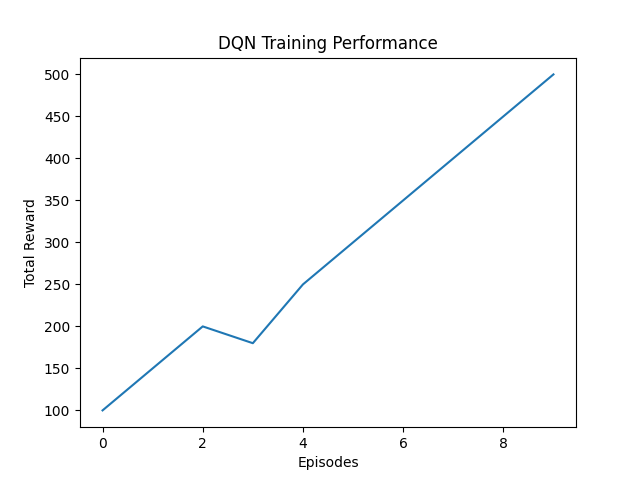

**Reinforcement Learning Project: DQN on CartPole**

This project implements Deep Q-Network (DQN) using Stable-Baselines3 to train an agent on the CartPole-v1 environment from OpenAI Gym. The trained model balances a pole on a moving cart using reinforcement learning.

**Project Structure**

**Installation& Setup**

1.) Clone the repository
https://github.com/TechAZsure/Reinforcement-AI_robot.git
cd rlproject

2.) Create & Activate Virtual Environment
python -m venv rl_env
source rl_env/bin/activate  # On macOS/Linux
rl_env\Scripts\activate     # On Windows

3.)Install the dependencies
pip install -r requirements.txt

**Training the model**

To train the DQN agent
"Python train.py"

The trained model will be saved as dqn_cartpole.zip

**Running the Trained Model**

To run the trained model and visualize its performance:
"Python simulate.py"

**Evaluating Model Performance**

To evaluate the agent’s performance over multiple episodes:
"Python evaluating.py"

**Checking of output**
"Python reward.py"

